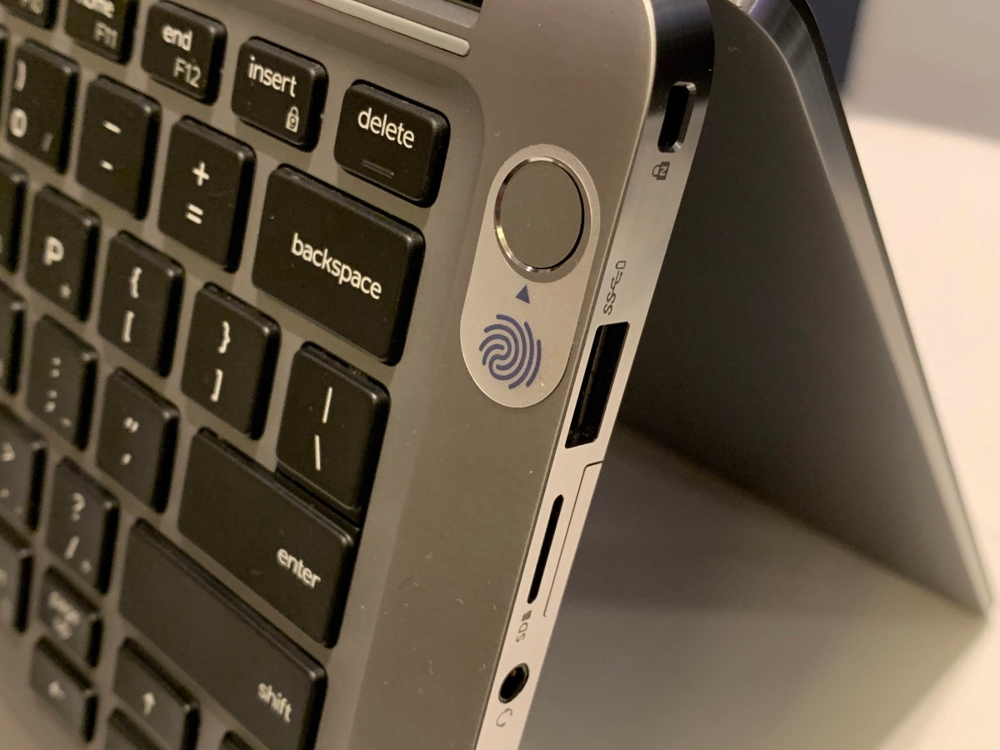

# Authenticators

An Authenticator is a cryptographic entity used to generate a public key credential and registered by a Relying Party (i.e. an application). This public key is used to authenticate by potentially verifying a user in the form of an authentication assertion and other data.

Authenticators may have additional features such as PIN code or biometric sensors (fingerprint, facial recognition…) that offer user verification.

.jpeg>)

## Roaming Authenticators

The roaming authenticator may have different forms. The most common form is a USB device the user plugs into its computer. It can be a paired Bluetooth device or a card with NFC capabilities.

Authenticators of this class are removable from, and can "roam" among, client devices.

## Platform Authenticators

A platform authenticator is usually not removable from the client device. For example an Android smartphone or a Windows 10 computer with the associated security chips can act as an authenticator.

.png>)

