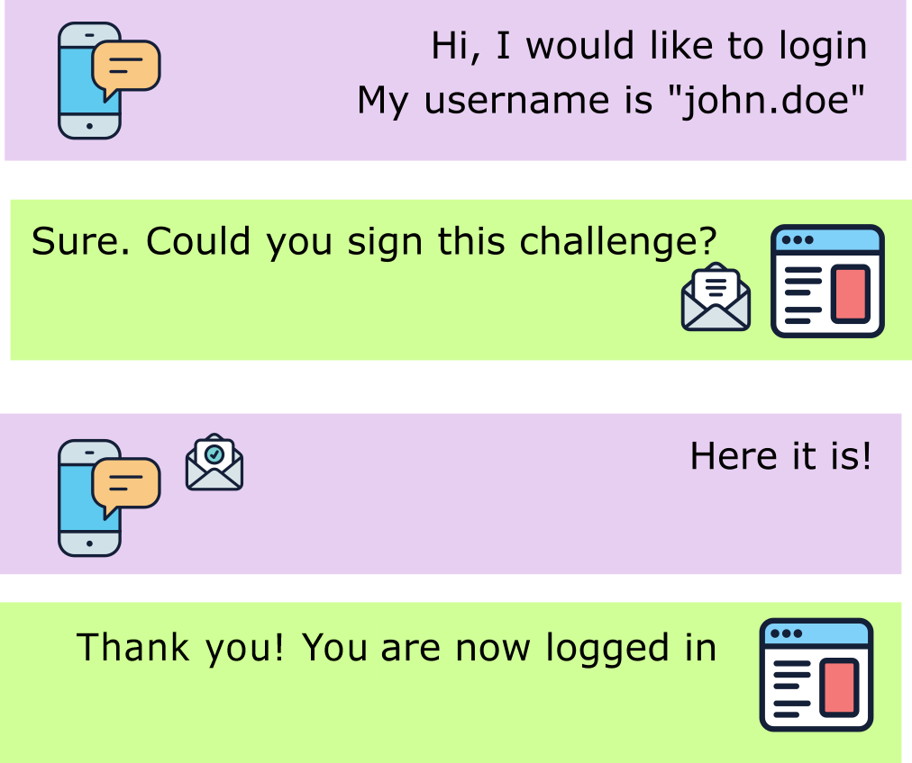

# Ceremonies

In WebAuthn, authentication workflows are called "ceremonies" - a term that emphasizes the formal, cryptographic nature of these operations. There are two main ceremonies that form the foundation of WebAuthn authentication.

## The Two Ceremonies

WebAuthn defines two distinct ceremonies:

### 1. Attestation Ceremony (Registration)

**Also called:** Creation Ceremony, Registration Ceremony

**Purpose:** Associates an authenticator with a user account

**When to use:**
* Creating a new user account with WebAuthn
* Adding an additional authenticator to an existing account
* Registering a backup security key

### 2. Assertion Ceremony (Authentication)

**Also called:** Request Ceremony, Authentication Ceremony, Login Ceremony

**Purpose:** Authenticates a user using a previously registered authenticator

**When to use:**
* User login
* Step-up authentication for sensitive operations
* Re-authentication after session timeout

## Common Workflow Pattern

Both ceremonies follow a similar two-step pattern:

### Step 1: Options Creation

The Relying Party (your server) creates options that:
* Define parameters for the operation
* Include a cryptographic challenge
* Specify requirements and preferences
* Are sent to the browser/authenticator

### Step 2: Response Verification

The authenticator:
* Prompts the user for interaction
* Performs cryptographic operations
* Returns a signed response
* The server validates the response


User interaction varies based on authenticator capabilities and your configuration. It can range from a simple button touch to biometric authentication (fingerprint, facial recognition, PIN code).


## Attestation Ceremony (Registration)

The attestation ceremony registers a new authenticator credential for a user.

.png>)

### Attestation Flow Breakdown

#### Server Side (Step 1)


```php
// 1. Create PublicKeyCredentialCreationOptions
$publicKeyCredentialCreationOptions = PublicKeyCredentialCreationOptions::create(
    rp: $rpEntity,                    // Your application identity
    user: $userEntity,                // User being registered
    challenge: random_bytes(32),      // Cryptographic challenge
    pubKeyCredParams: $pubKeyCredParams,  // Allowed algorithms
    authenticatorSelection: $authenticatorSelection  // Device requirements
);

// 2. Store challenge in session (for later verification)
$session->set('webauthn_creation_challenge', $publicKeyCredentialCreationOptions->challenge);

// 3. Send options to browser as JSON
return new JsonResponse($publicKeyCredentialCreationOptions);
```


#### Client Side (Browser)

```javascript
// 1. Receive options from server
const options = await fetch('/webauthn/register/options').then(r => r.json());

// 2. Call WebAuthn API
const credential = await navigator.credentials.create({
    publicKey: options
});

// 3. Send credential back to server
await fetch('/webauthn/register', {
    method: 'POST',
    body: JSON.stringify(credential)
});
```

#### Server Side (Step 2)


```php
// 1. Load the attestation response
$publicKeyCredential = $serializer->deserialize(
    $request->getContent(),
    PublicKeyCredential::class,
    'json'
);

// 2. Verify the response
$credentialSource = $attestationValidator->check(
    $publicKeyCredential->response,
    $publicKeyCredentialCreationOptions,
    $request->getHost()
);

// 3. Save the new credential
$credentialRepository->saveCredentialSource($credentialSource);
```


### What Happens During Attestation?

1. **Challenge Generation**: Server creates a random challenge to prevent replay attacks
2. **User Prompt**: Browser asks user to interact with authenticator
3. **Key Generation**: Authenticator generates a new public/private key pair
4. **Attestation**: Authenticator signs the public key and client data
5. **Verification**: Server verifies signatures and stores the public key
6. **Storage**: Credential is saved and associated with the user account

### Attestation Data Contains

* **Public Key**: Used to verify future signatures
* **Credential ID**: Unique identifier for this credential
* **AAGUID**: Authenticator model identifier
* **Signature Counter**: Used to detect cloned authenticators
* **Attestation Statement**: Optional proof of authenticator authenticity

## Assertion Ceremony (Authentication)

The assertion ceremony authenticates a user with a previously registered credential.



### Assertion Flow Breakdown

#### Server Side (Step 1)


```php
// 1. Get user's registered credentials
$credentials = $credentialRepository->findAllForUserEntity($userEntity);
$allowedCredentials = array_map(
    fn($c) => $c->getPublicKeyCredentialDescriptor(),
    $credentials
);

// 2. Create PublicKeyCredentialRequestOptions
$publicKeyCredentialRequestOptions = PublicKeyCredentialRequestOptions::create(
    challenge: random_bytes(32),           // New challenge
    allowCredentials: $allowedCredentials, // User's credentials
    userVerification: 'preferred'          // UV requirement
);

// 3. Store challenge in session
$session->set('webauthn_request_challenge', $publicKeyCredentialRequestOptions->challenge);

// 4. Send options to browser
return new JsonResponse($publicKeyCredentialRequestOptions);
```


#### Client Side (Browser)

```javascript
// 1. Receive options from server
const options = await fetch('/webauthn/login/options').then(r => r.json());

// 2. Call WebAuthn API
const credential = await navigator.credentials.get({
    publicKey: options
});

// 3. Send assertion back to server
await fetch('/webauthn/login', {
    method: 'POST',
    body: JSON.stringify(credential)
});
```

#### Server Side (Step 2)


```php
// 1. Load the assertion response
$publicKeyCredential = $serializer->deserialize(
    $request->getContent(),
    PublicKeyCredential::class,
    'json'
);

// 2. Find the credential
$credentialSource = $credentialRepository->findOneByCredentialId(
    $publicKeyCredential->rawId
);

// 3. Verify the assertion
$updatedCredential = $assertionValidator->check(
    $credentialSource,
    $publicKeyCredential->response,
    $publicKeyCredentialRequestOptions,
    $request->getHost(),
    $userEntity->id
);

// 4. Update credential (counter may have changed)
$credentialRepository->saveCredentialSource($updatedCredential);

// 5. Log the user in
$session->set('user_id', $userEntity->id);
```


### What Happens During Assertion?

1. **Challenge Generation**: Server creates a new random challenge
2. **Credential Selection**: Browser identifies available credentials
3. **User Prompt**: User interacts with authenticator (touch, PIN, biometric)
4. **Signature**: Authenticator signs the challenge with the private key
5. **Verification**: Server verifies signature using stored public key
6. **Counter Check**: Server verifies counter to detect cloning
7. **Authentication**: If valid, user is logged in

### Assertion Data Contains

* **Authenticator Data**: Flags, counter, extensions
* **Client Data**: Origin, challenge, type
* **Signature**: Cryptographic proof using the private key
* **User Handle**: Optional user identifier (for usernameless authentication)

## Key Differences Between Ceremonies

| Aspect | Attestation (Registration) | Assertion (Authentication) |
|--------|---------------------------|---------------------------|
| **Purpose** | Create new credential | Verify existing credential |
| **JavaScript API** | `navigator.credentials.create()` | `navigator.credentials.get()` |
| **Server Action** | Store new public key | Verify signature |
| **Key Operation** | Generate key pair | Sign with private key |
| **Options Class** | `PublicKeyCredentialCreationOptions` | `PublicKeyCredentialRequestOptions` |
| **Validator Class** | `AuthenticatorAttestationResponseValidator` | `AuthenticatorAssertionResponseValidator` |
| **User Experience** | "Register security key" | "Use security key to sign in" |

## Security Considerations

### Challenge Uniqueness

Both ceremonies require a unique, random challenge:


```php
// Always generate a fresh challenge
$challenge = random_bytes(32);  // 32 bytes = 256 bits of entropy

// NEVER reuse challenges
// NEVER use predictable challenges (like timestamps)
// NEVER skip challenge verification
```


### Challenge Storage

Store challenges temporarily in server-side sessions:


```php
// Store during Step 1 (options creation)
$session->set('webauthn_challenge', base64_encode($challenge));
$session->set('webauthn_challenge_expires', time() + 60); // 60 second timeout

// Verify and delete during Step 2 (response validation)
$storedChallenge = base64_decode($session->get('webauthn_challenge'));
$session->remove('webauthn_challenge');

if (time() > $session->get('webauthn_challenge_expires')) {
    throw new \Exception('Challenge expired');
}
```


### Origin Validation

Always verify the origin matches your domain:


```php
// Server must verify origin during validation
$credentialSource = $attestationValidator->check(
    $publicKeyCredential->response,
    $publicKeyCredentialCreationOptions,
    'https://example.com'  // Must match your actual domain
);
```


## Common Pitfalls

### ❌ Challenge Reuse

```php
// WRONG: Reusing the same challenge
$challenge = 'my-static-challenge';  // Never do this!
```

### ❌ Skipping Verification

```php
// WRONG: Trusting client data without validation
$credentialId = $_POST['credentialId'];
$user = $userRepository->find($credentialId); // DON'T!
```

### ❌ Incorrect Origin

```php
// WRONG: Verifying with wrong domain
$attestationValidator->check($response, $options, 'http://localhost');
// But the actual domain is https://example.com
```

## Best Practices

### ✅ Use Timeouts

Set reasonable timeouts for user interaction:


```php
$publicKeyCredentialCreationOptions = PublicKeyCredentialCreationOptions::create(
    rp: $rpEntity,
    user: $userEntity,
    challenge: random_bytes(32),
    timeout: 60000  // 60 seconds in milliseconds
);
```


### ✅ Handle Errors Gracefully

Provide helpful error messages:


```php
try {
    $credentialSource = $attestationValidator->check(/* ... */);
} catch (\Webauthn\Exception\InvalidDataException $e) {
    return new JsonResponse([
        'success' => false,
        'error' => 'Invalid authenticator response. Please try again.'
    ], 400);
}
```


### ✅ Store Credential Metadata

Keep track of when and how credentials were registered:


```php
$credential->createdAt = new \DateTimeImmutable();
$credential->lastUsedAt = null;
$credential->name = 'My YubiKey';  // Allow users to name their keys
$credential->transports = ['usb', 'nfc'];  // Store transport hints
```


## See Also

* [Authenticators](authenticators.md) - Learn about different authenticator types
* [User Verification](user-verification.md) - Understand UP vs UV flags
* [Pure PHP Registration](../pure-php/authenticator-registration.md) - Detailed attestation implementation
* [Pure PHP Authentication](../pure-php/authenticate-your-users.md) - Detailed assertion implementation
* [WebAuthn Specification](https://www.w3.org/TR/webauthn-2/) - Official ceremony specifications
